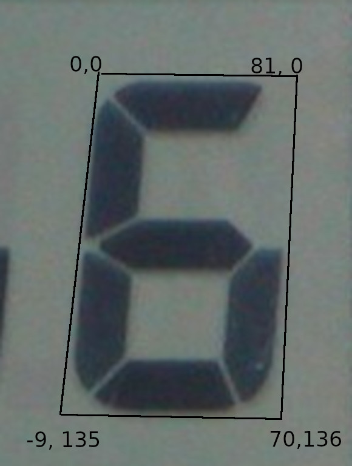
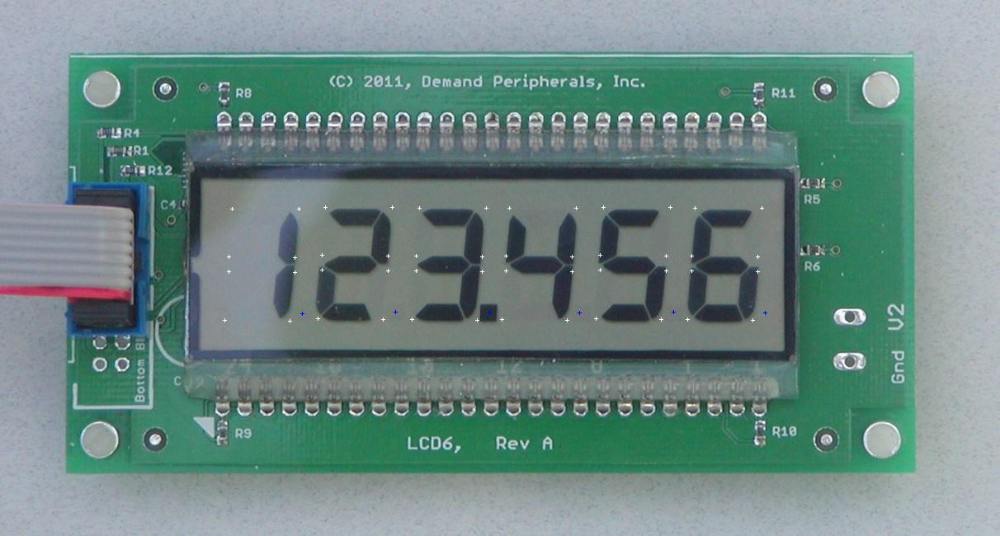
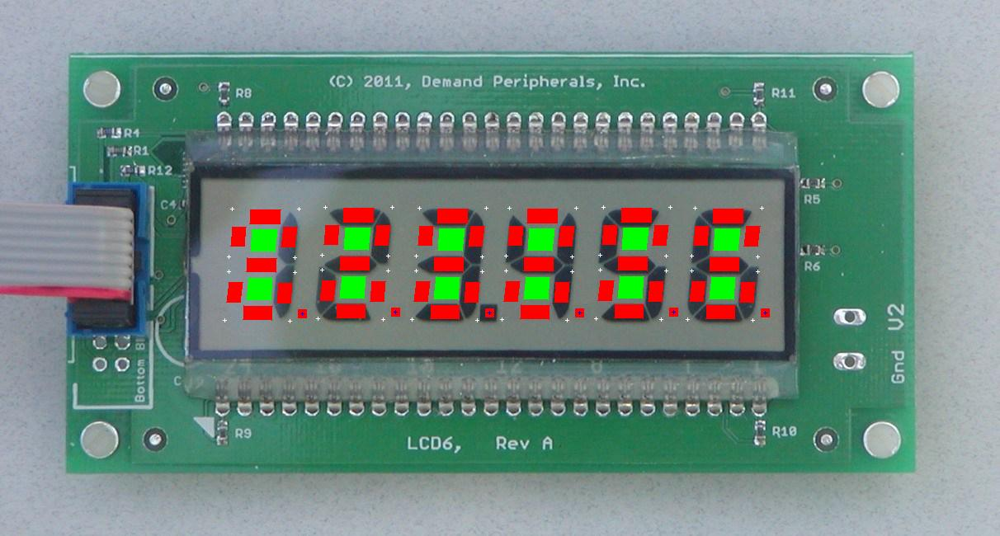

# LCD
Library to decode 7 segment characters in images.

## Configuration

This library is designed to decode 7 segment digits in images. The decoder operates by configuring
a template that defines the outline of a digit as a quadrilateral, and the width of the segments.
This template is then used to identify one or more 7 segment display digits in an image.

For example, given the image:

There are 6 digits in the display that are all the same size, so a digit template can be used
to define the size and shape of the digits, and then a definition of 6 digits that use the template as a base.

The configuration that defines this is:
```
lcd=A,81,0,70,136,-9,135,21,85,127
digit=A,281,253
digit=A,394,251
digit=A,508,252
digit=A,617,252
digit=A,731,251
digit=A,842,252
```
(The configuration uses the [config](http://github.com/aamcrae/config) library to parse
the lines in the file configuration). The core library does not _require_ the use of this config library - the library can be
configured discretely using method calls.

The first line defines a digit template, which is expressed as a name or tag ('A' in this instance),
3 pairs of (X, Y) co-ordinates, a pixel width of the segments
(21 in this case), and an optional (X, Y) co-ordinate defining the centre of the decimal place.
All of the (X, Y) co-ordinates are _offsets_ from a base point (0, 0) that represents the *top left* corner of the digit.
Since the top left corner in the template is always considered (0, 0), it is not included in the template definition.
The first 3 pairs of co-ordinates define the *top right*, *bottom right* and *bottom left* of the outline of the digit.
The final (optional) pair indicates the location of the decimal place. If this pair is not present, no decimal place is
assumed.
The following image shows how the dimensions of the digit are calculated in the template:


After the template, 6 separate lines define the 6 digits in the image, each of which uses the template named 'A' to define the
size of the digit, and a (X, Y) co-ordinate pair that defines the *top left* of the digit.

To make it easy to verify the location of the digits, a utility program named [sample](utils/sample/sample.go) is provided
that reads a configuration and overlays on an image where the digits are e.g run thus:
```
./sample --input=lcd6.jpg --config=lcd6.config --fill=false
```
generates the file output.jpg:

where each segment's corner has a white arrow placed on it. Running the program with the ```fill``` option turned on:
```
./sample --input=lcd6.jpg --config=lcd6.config
```
generates an image where the actual sampling blocks used to decode the digits are filled in:

The red areas are the areas of the segments that are sampled. The green areas are scanned to determine what an 'off'
segment would be measured as.

## Image sources

The library uses the standard Go image package for processing the image to be decoded.
The ```sample``` program uses static JPEG or PNG files as the source of the image for the overlay, which
is fine for initial configuration and testing.
However for real applications, the image should be separately sourced and supplied to the library.
This is usually involves some form of webcam source.
For example, the ```imageserver``` program that is part of the example programs from the
(webcam)[http://github.com/aamcrae/webcam] package is one that is easy to use.

Some of the utility programs (such as the (calibrate)[utils/calibrate/README.md] program) can be supplied
with a URL that is used to retrieve an appropriate image.

## Calibration

A major part of the library is the dynamic level detection and setting so that segments are correctly
recognised as 'on' or 'off', depending on the luminosity of the segments.
There are a couple of significant factors at play here:
1. Depending on the source of the image, conditions can change gradually because of changing light levels (e.g across the day).
For best results, some form of lighting is recommended on the display being scanned, but even with this, ambient light changes
mean that over time the 'on' and 'off' light levels may vary considerably, and unless this change taken into account, the accuracy of
the decoding can be affected.
2. Even with consistent lighting, the differences between 'on' and 'off' can vary widely across the complete image,
so that levels that work with one digit may not work consistently with other digits in the same image.

To address this, each digit that is being processed in the image maintains its own set of calibrated levels that are used
to detect when a segment is 'on' or 'off'.
These levels are dynamically adjusted when it is determined a successful set of digit decoding has occurred, so that
if light levels change, the threshold levels used to detect 'on' and 'off' are adjusted accordingly.

At regular intervals, these threshold levels are saved away in an internal database, along with a quality measurement, and
a new set are chosen from this database. Poor quality levels are discarded.
The best quality threshold levels are checkpointed to a file. These can be restored whenever a restart occurs, so that the library's
decoding accuracy is consistent from the start.

Once a working set of high quality threshold limits is available, the library can handle
widely varying light conditions whilst maintaining a high level of decoding accuracy.
However, the challenge then becomes how to initially bootstrap this set of calibration values.

The library has a facility whereby a preset string of characters can be supplied along with an image that has the corresponding
7 segment characters, and the library will use this string of characters to build the 'on' and 'off' levels all the segments.
So an inital set of images along with the corresponding character strings can be used to build an initial calibration database.

Another very useful tool is the [calibrate](utils/calibrate/calibrate.go) program, which
allows dynamic editing of the configuration defining the digit template and digit definitions, and also
allows bootstrapping of the calibration levels through manual entry of the character strings.

For example:
```
./calibrate --config=sample.conf --calibration=/tmp/calibrate --train=false
```
will start a web server on port 8080, where images read from the image source are displayed optionally with the overlay digit markings.
Changing the template or digit configuration in the ```sample.conf``` file will reload the configuration, displaying the overlay reflecting
the changes.
Running the program with ```--train=true``` will allow the manual entry of a character string, which is then used to dynamically adjust
the calibration database, which is written to ```/tmp/calibration```. The program attempts to decode the digits, and will display the
decoded data. If it is correct, hitting _enter_ without entering a string will use the decoded data as input to the calibration adjustment.

This is not an officially supported Google product.
